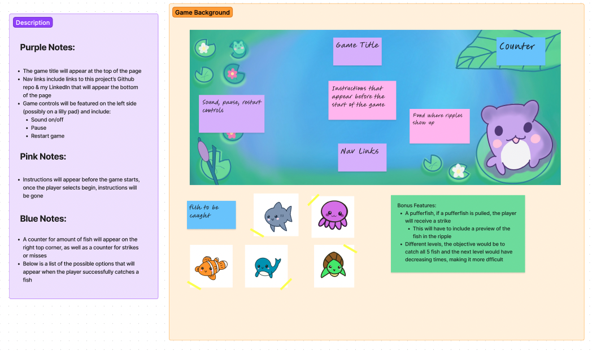

# SinkOrSwim

[Link to Game!](https://shannale.github.io/sinkOrSwim/)

## Background 
You are in search of fish to catch in this magical pond that is a home for all sea creatures.
When the game begins, it will start off with an empty pond with a fishing rod controlled by the cursor. This pond is a circular grid that will generate ripples at a randomized location with a randomized timer that will show ripples indicating to the player the location of the fish. For each iteration of the game collecting the fish follow these rules: 

1) The player must correctly identify the location of the ripple and click within the allotted time* in the area before the ripples disappear to be able to successfully collect the fish. 

2) If a player is controlling the fishing rod within the correct area, but clicks at a time when not indicated, the ripple disappears and the fish swims away free. 

** Once a ripple has appeared, the player must wait for a `PULL` message to pop up indicating when to click. 

There are many variations of fish with the combination of timing in the game `SinkOrSwim`. The logistics of the game will be outlined in the `Functionality & MVP` sections. 

## Functionality & MVPs 

In `SinkOrSwim`, users will be able to:
- Start the game 
- Control the fishing rod with the cursor and click to activate 
- Collect different fish and increase their score 
- Have 3 strikes to miss any fish before the game is over 

## Technologies, Libraries, APIs

- The `Canvas API` to render the game
- `Webpack and Babel` to bundle and transpile the source Javascript code 
-  `npm` to manage project dependencies 

## Bonus Features 

There could be many bonus aspects that could be added to the game, such as: 
- A puffer fish that would cause the user to gain a strike if caught 
    - This would add to the ripple feature to preview the fish that will be generated 
- Levels to the game that have decreasing timers, each level would be completed once all fish are caught, then it would repeat. 
